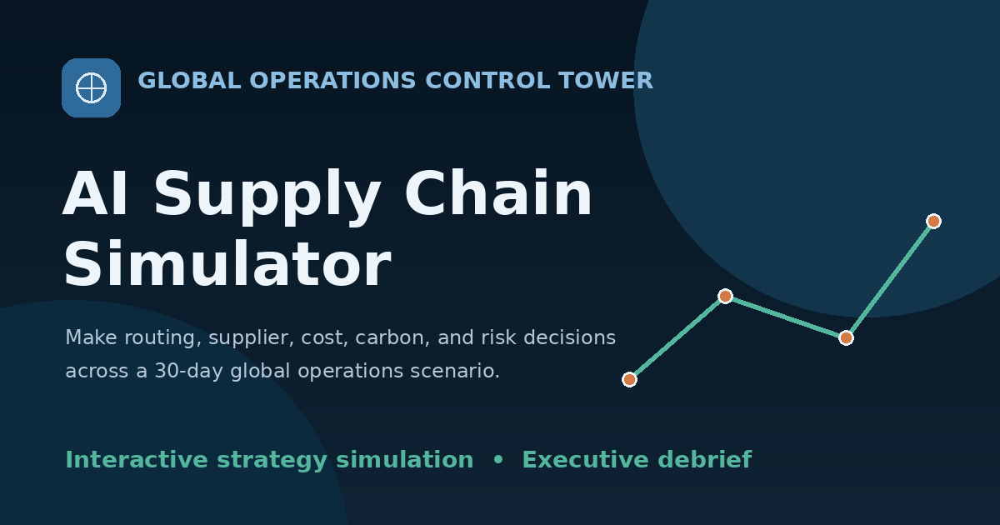

# AI Supply Chain Simulator

An interactive, browser-based supply chain operations simulation where you manage a global shipment from Shanghai to Los Angeles and Rotterdam under budget, deadline, and disruption pressure.

[**Launch the Live Simulator →**](https://marcelineyu.github.io/AI-Supply-Chain-Simulator/)



## What This Project Demonstrates

This project shows end-to-end front-end product development for a decision-driven business simulation:

- Translating a complex operations scenario into a clear user experience
- Modeling multi-metric tradeoffs across cost, delivery, inventory, carbon, customer satisfaction, and supplier trust
- Building a static, deployable web application without frameworks or a backend
- Supporting executive-style reporting with debrief analysis and PDF export
- Adding lightweight Python tooling for source and data integrity checks

## Scenario Overview

You play the Supply Chain Manager at SCS. A 4,300-unit consumer-goods shipment must reach:

- **Los Angeles:** 2,500 units by Day 28
- **Rotterdam:** 1,800 units by Day 30

You start with a **$150,000 budget**, choose an initial air/sea transport strategy, and respond to **10 scripted crises** over 30 simulated days. Every decision changes multiple operating metrics, and some negotiation outcomes are probabilistic.

## Simulation at a Glance

| Dimension | Scenario |
|---|---|
| Origin | Shanghai consolidation hub |
| Destinations | Los Angeles and Rotterdam |
| Total volume | 4,300 units |
| Los Angeles requirement | 2,500 units by Day 28 |
| Rotterdam requirement | 1,800 units by Day 30 |
| Operating horizon | 30 simulated days |
| Initial budget | $150,000 |
| Initial strategies | 100% air, 100% sea, 40/60 balanced, or 20/80 cost-focused |
| Crisis events | 10 operational disruptions |
| Final output | Executive results and Strategic Debrief |

## How It Works

1. **Choose a transportation strategy** based on cost, speed, carbon, and schedule exposure.
2. **Launch the global network** and review its initial operating position.
3. **Respond to ten crisis events**, each presenting three operational alternatives.
4. **Track live metrics** as decisions change cost, inventory, delivery performance, risk, carbon, customer satisfaction, and supplier trust.
5. **Receive an executive assessment** that separates decision quality, realized outcome, and the effect of luck.

## Key Features

- Editorial introduction and rules flow before gameplay begins
- Four transportation strategies (100% air, 100% sea, 40/60 balanced, 20/80 cost-focused)
- Interactive global route map with live ETA, cost impact, and risk indicators
- Real-time metrics dashboard and activity log
- Ten crisis events with three decision options each
- Final executive assessment with score breakdown
- Strategic Debrief covering decision quality, outcomes, luck factor, and benchmark comparison
- PDF export of the debrief report
- Reset and replay support
- Responsive layout for desktop and mobile
- GitHub Pages compatible deployment

## Decision and Evaluation Model

The simulator distinguishes between three concepts:

- **Decision Quality** — whether a choice was strategically reasonable given the information and constraints available at the time
- **Outcome** — what happened after the decision was made
- **Luck Factor** — the effect of probabilistic events on the realized result

This separation prevents a strategically sound decision from automatically being classified as poor simply because an unfavorable random outcome occurred.

> The target operating profile and performance benchmarks are defined within the simulator. They are not external industry averages or survey data.

## Technical Stack

| Layer | Technology | Role |
|---|---|---|
| Structure | HTML | Page layout and content |
| Presentation | CSS | Visual design and responsive layout |
| Application logic | JavaScript | Simulator engine, crisis data, UI behavior |
| Validation | Python (stdlib) | Offline repository and source checks |

The simulator runs entirely in the browser. No build step, npm install, database, or server-side runtime is required for the web application.

## Skills Highlighted

- Vanilla JavaScript application architecture
- Stateful simulation modeling and metric calculations
- DOM-driven UI updates and screen transitions
- CSS layout, theming, and responsive design
- Static deployment with GitHub Pages
- Python scripting for non-destructive validation

## Project Structure

```
AI-Supply-Chain-Simulator/
├── index.html                              # Page structure and content
├── app.js                                  # Simulator logic, crisis data, UI behavior
├── styles.css                              # Styles and responsive layout
├── assets/
│   └── images/
│       └── supply-chain-terminal.webp      # Introduction hero image
├── scripts/
│   └── validate_simulator_data.py          # Source and data validation tool
├── AI-Supply-Chain-Simulator-social-preview.png
├── .gitattributes                          # GitHub language-detection rules
└── README.md
```

## Run Locally

From the project root:

```bash
python -m http.server 8000
```

On Windows:

```bash
py -m http.server 8000
```

Open http://localhost:8000

Use a local HTTP server rather than opening `index.html` directly via `file://`, so relative asset paths resolve correctly.

## Source Validation

```bash
python scripts/validate_simulator_data.py
```

Or on Windows:

```bash
py scripts/validate_simulator_data.py
```

The validator checks required files, asset references, crisis data integrity, probability ranges, and that large Base64 images are not embedded in HTML. Python is used only for offline validation; it does not run the web simulator.

## Deployment

This repository is compatible with GitHub Pages. Deploy the project root as static files. Relative paths such as `styles.css`, `app.js`, and `./assets/images/supply-chain-terminal.webp` work when served over HTTP from a repository subdirectory.

## Scope and Limitations

This is a portfolio and learning simulation designed to demonstrate operational decision design, scenario modeling, interactive product development, and executive-style analysis.

It is **not** a production transportation-management system, logistics optimizer, or source of external industry benchmarks. Costs, emissions, probabilities, thresholds, and scoring assumptions are simulator-defined for this scenario.
